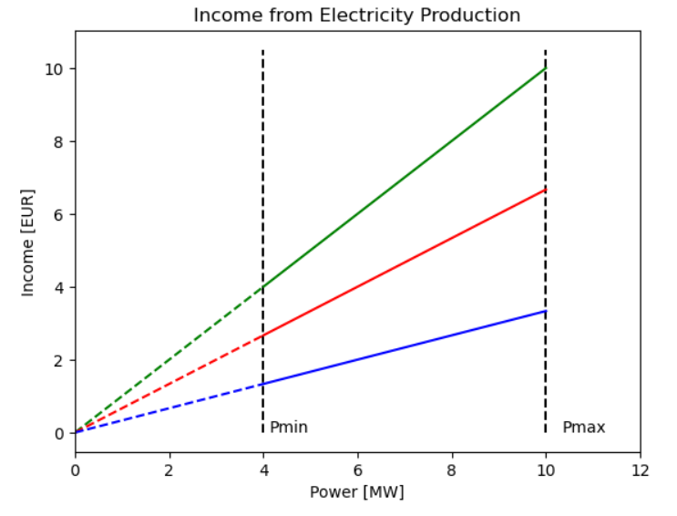
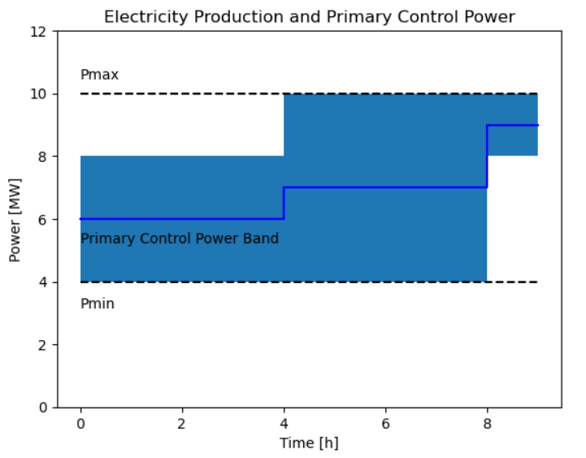
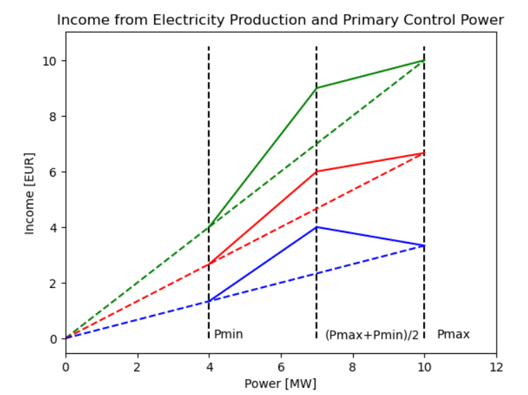

Download python file and extract the datasets.

You can find a .exe for win64 here: [https://drive.google.com/drive/folders/1AXrvOB1_Tahe7awww3GUY8QRZIQZaU5q?usp=drive_link]

# Ancillary Services Calculator

The aim of this application is to compare the income of ower plant offering electricity producition and ancillary services in Switzerland.

The application takes few variables, which can be applied to any power plant: 

- Maximal Capacity P<sub>min</sub>
- Minimal Capacity P<sub>max</sub>
- Annual Reservoir Capacity R

Than calculates the most profitable mode of operation:

1. [Electricity Production](#ElProd)
2. [Electricity Production and Primary Control Reserves](#PRL)

For calculation application uses datasets:
- [EPEX Spot Market D-1 Hourly Prices](https://transparency.entsoe.eu/transmission-domain/r2/dayAheadPrices/show?name=&defaultValue=true&viewType=TABLE&areaType=BZN&atch=false&dateTime.dateTime=02.12.2023+00:00|CET|DAY&biddingZone.values=CTY|10YCH-SWISSGRIDZ!BZN|10YCH-SWISSGRIDZ&resolution.values=PT60M&dateTime.timezone=CET_CEST&dateTime.timezone_input=CET+(UTC+1)+/+CEST+(UTC+2))
- [Swissgrid Auction Results for Control Power](https://www.swissgrid.ch/en/home/customers/topics/ancillary-services/tenders.html)

The electricity prices $S_{el}$ have resolution of 1 hour and Primary Control Power tenders $P_{PRL}$ have resolution of 4 hours: 
t = {00:00-04:00 , 04:00-08:00, 08:00-12:00, 12:00-16:00, 16:00-20:00, 20:00-24:00}

For cost comparision, the income from electricity production is summed up during one tender of four hours:


Example of prices of electricity production and primary control from 2023. 


## Electricity Production Only <a name="ElProd"></a>

### Assumptions:
- Fixed operating cost of a power plant. This value does not vary between the operation modes and therefore is not considered for calculations​.
- Reservoir is constant for the year​. No inflow/losses.
- Using datasets from the past: Same application can be run on forecasts. 
- No inflation

Operating Capacity P can be choosen between P<sub>min</sub> < P < P<sub>max</sub> with resolution of 1MW: 


The prices of electricity S<sub>el</sub> vary on hourly basis. For each hour the income from the electricity production can be calculated by $C_{el}(P) = S_{el} * P$



## Selection Algorithm: 
The most profitable mode of operation is running the plant at times when the income is maximal while minimalizing the reservoir usage. In case of Electricity production mode of operation the income curves are linear, making this calculation is straightforward: The time periods with the highest electricity prices $S_{el}$ are the most profitable. The algorithm first sorts the dataset from highest $S_{el}$ to lowest, than chooses $C_{el}(P_{max})$ until reservoir is used up: 

```python
    #order the result table containing the electricity prices
    
    result_df = result_df.sort_values(by=['C', 'B'], ascending=False)
    result_df = result_df.reset_index(drop=True)
    
    #iterate throgh rows
    for index, row in result_df.iterrows():
        #break statements to do not overexceed the table size
        if (index >= len(result_df)):
            break    
        #stop if the reservoir is empty
        if (res < p1.P_min):
            break
        #dont operate the power plant if the prices are negative 
        if (p1.P_max*row['S_el'] <= 0)
            break
        #if you cannot opearate at full capacity, discharge the entire reservoir 
        elif (res <= p1.P_max):
            result_df.at[index, 'In_el'] =  res * row['S_el'] 
            result_df.at[index, 'P_el'] =  resp
            res = 0
        #if possible operate at maximal capacity
        else:
            result_df.at[index, 'In_el'] = p1.P_max*row['S_el'] 
            result_df.at[index, 'P_el'] = p1.P_max
            res -= p1.P_max

```

## Electricity Production and Primary Control Reserves <a name="PRL"></a>

### Assumptions
- Price-as-clear: One price for Primary Control Reserves operation mode $S_{PRL}: highest accepted bid sets the price for all.
- While offering PRL, the downwards and upwards regulation contribute equally to overall capacity. While operating the power plant at capacity $P$ those contributions add up to zero: no resulting reservoir usage.

PRL regulation is symmetric. The maximal capacity PRL can be offered  is given by the minimal difference between the operating capacity and either maximal and minimal operating capcity: 



With given price for PRL $S_{PRL}, the maximal income from PRL at given operating P is described by the expression $P_{PRL} \cdot$ min$(P-P_{min}, P_{max}-P)$.

**Important remark:**
As no reservoir is used up while offering PRL, it is always most profitable to offer maximal PRL capacity whenever possible

The total income is given by the sum electricity production and primary control reserves:
$$S_{PRL}(P) =  S_{el} * P_{el} + S_{PRL} \cdot max(P-P_{min}, P_{max}-P)$$




The bent in the income curve is caused by the fact that the PRL band is maximal at $P_{min} + P_{max} / 2$, and decreases symmetricly away from this point until decreasing to zero at $P_{min}$ and $P_{max}$, where only electricity production can be obtained.

## Selection Algorithm

Here the selection process is a bit more tricky: For each time period i is both possible that either $C_{PRL}_i(P_{max})$ or  $C_{PRL}_i(P_{max} + P_{min})/2)$ offer the best ratio between income and reservoir. The algorithm sorts the dataset according to $C_{PRL}_i(P_{max})$ and cosiders two cases: 

1. It is more profitable to operate on two subsequent time periods on $C_{PRL}_i(P_{max} + P_{min})/2)$ and $C_{PRL}_{i+1}(P_{max} + P_{min})/2)$ 
2. It is profitable to operate on full capacity on same time period $C_{PRL}_i(P_{max})$

```python
    #sort dataset
     result_df = result_df.sort_values(by=['C', 'B'], ascending=False)
    result_df = result_df.reset_index(drop=True)

    #iterate through entire dataset
    for index, row in result_df.iterrows():
        #terminate if reservoir empty
        if (res < p1.P_min):
            break
        #terminate if PRL would bring negative income
        if (max(result_df.at[index, 'B'],result_df.at[index, 'C']) <= 0):
            break
        #terminate if table would be exceeded
        if (index >= len(result_df)-1):
            result_df.at[index, 'In_as'] = result_df.at[index, 'C']
            result_df.at[index, 'P_as'] = p1.P_max
            res = res - p1.P_max
            break
        #empty reservoir
        elif (res < p1.P_mid):
            result_df.at[index, 'In_as'] = p1.priceFunction(res, row['S_el'], row['S_prl'])
            result_df.at[index, 'P_as'] = res
            res = 0
            break
        #if possible empty reservoir at Pmid
        elif (res < p1.P_max):
            result_df.at[index, 'In_as'] = result_df.at[index, 'B']
            result_df.at[index, 'P_as'] = p1.P_mid
            res = res - p1.P_mid
        
        elif ((result_df.at[index, 'B'] + result_df.at[index+1, 'B'])/(p1.P_max + p1.P_min) > (result_df.at[index, 'C'])/p1.P_max):
            result_df.at[index, 'In_as'] = result_df.at[index, 'B']
            result_df.at[index, 'P_as'] = p1.P_mid
            res -= p1.P_mid
        else:
            result_df.at[index, 'In_as'] = result_df.at[index, 'C']
            result_df.at[index, 'P_as'] = p1.P_max
            res = res - p1.P_max
```


